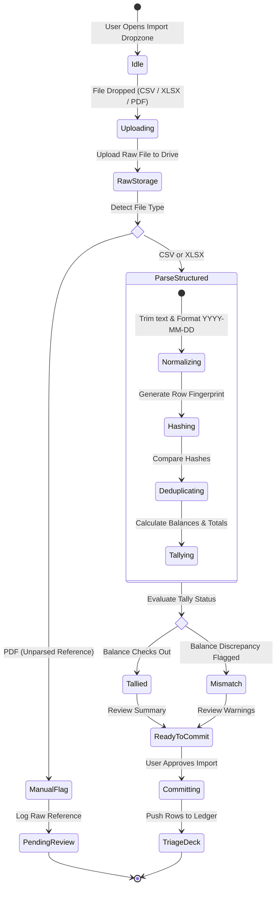
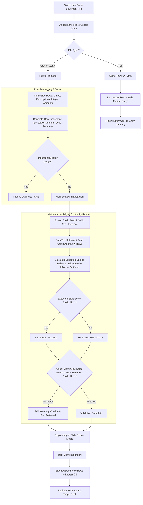
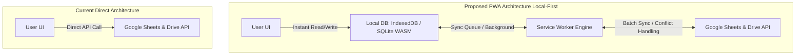
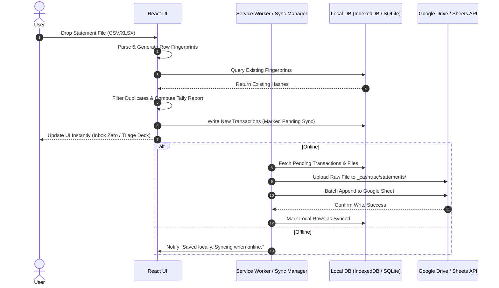
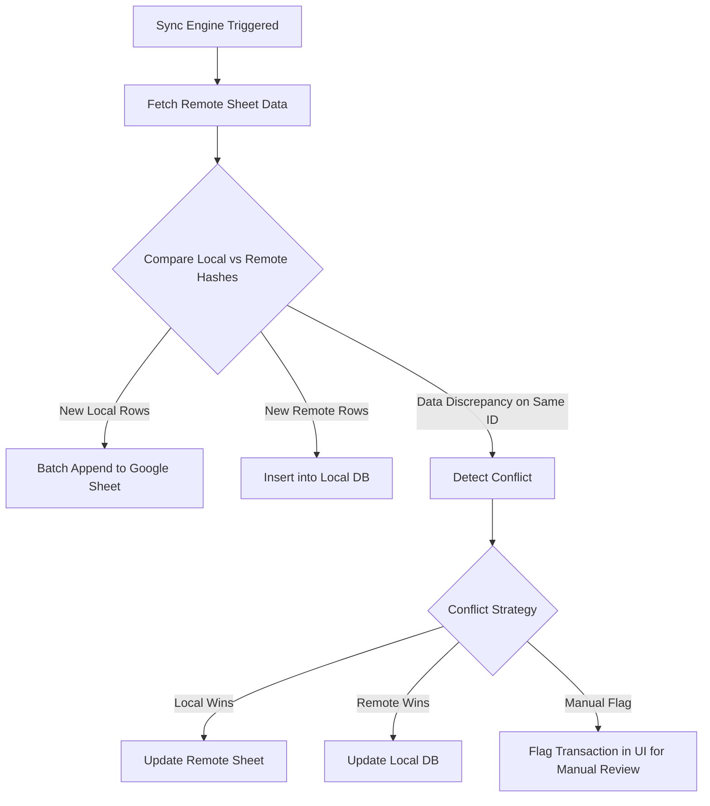

# CashTrac v2 — Product Requirements & Architectural PRD

> Company finance for PT Fastrac Garda Indonesia (Nirmal — CEO, Shalfin — COO), without the spreadsheet dread.
> This document is the source of truth for CashTrac v2. As part of this assignment, analyze this document, review the provided codebase, and present your architectural recommendation.

---

## 1. Vision

A financial tracker with a **smart UI** that makes managing company finances and accounting fast, responsive, and intuitive. Plain Excel is boring; this should be the opposite — quick triage to categorize, clear visual dashboards, and zero complex backend server to maintain.

**Key principles:**

- **Google Drive is the persistent storage layer.** Ledger data lives in Google Sheets (always openable as raw sheets), raw statement files live in Drive as permanent reference.
- **No server, no database infrastructure to maintain.** A client-side React app talking directly to Google APIs.
- **Workspaces = Drive folders.** PT Fastrac is one workspace (shared between owners). Users can also create private workspaces. **Access is enforced by Drive sharing** — an unshared folder is invisible/unreadable to non-collaborators.
- **Duplicate-safe imports.** Weekly and monthly bank statements overlap naturally; row fingerprints resolve duplicates.
- **Keyboard-first triage.** Categorizing transactions should feel like a game, not data entry.

---

## 2. Core Architecture & Tech Stack

- **Stack:** Vite + React + TypeScript, Tailwind CSS v4, Google Identity Services (client-side OAuth), Google Sheets API v4 + Drive API v3, Framer Motion, PapaParse (CSV), SheetJS from CDN (xlsx), Phosphor icons, Geist fonts.
- **Auth flow:** Google sign-in (popup) → token client (implicit flow, no backend) → app discovers/connects a workspace folder → reads that workspace's **Meta sheet** → reads one **ledger sheet per account**.
- **Scopes:** `spreadsheets` (read/write ledgers + meta), `drive.file` (create/upload raw statement files + workspace structure), `drive.readonly` (list folders, resolve ids, discover workspaces).

---

## 3. Workspace & Data Model


```

Drive/
└── one folder per workspace — sharing controls who can connect & read it
  Workspace: PT Fastrac  (shared with Nirmal + Shalfin)
  └── _cashtrac/
      ├── meta/Meta           ← spreadsheet: Accounts, Groups, Revenue tabs
      ├── ledgers/            ← one spreadsheet per account (Transactions + Imports tabs)
      └── statements/<account>/ ← raw uploaded statement files, kept as reference
  
```


**Meta spreadsheet tabs:**

- **Accounts:** `id, name, type (bank|ewallet|cash|gateway), owner, groupId, sheetId, currency, lastUpdated, lastTransactionDate, cadenceDays`
- **Groups:** `id, name, accountIds, owner`
- **Revenue:** `id, date, type (unearned|unbilled), description, amount, driveLink, note` — totals only.

**Ledger spreadsheet tabs:**

- **Transactions:** `date, description, category, amount, balance, source, sourceLink, fingerprint, importedAt, marked, invoiceLink, notes`
- **Imports (audit log):** `filename, rawFileLink, source, statementPeriod, importedAt, rowsFound, rowsNew, rowsDuplicate, rowsConflict`

**Money Rule:** Integer rupiah only. No float math anywhere. `parseAmountRupiah` strips symbols/commas to return an integer.

---

## 4. Import & Dedup Logic

1. User picks an account → uploads a statement (CSV/xlsx; **PDF = raw-reference only** in v1).
2. **Raw file uploaded to Drive first** (`_cashtrac/statements/<account>/<date>-<filename>`) — permanent reference even if unparsed. Drive link recorded on Imports log + each imported row.
3. Parse using PapaParse (CSV) or SheetJS via CDN (xlsx).
4. Normalize: trim/lowercase description, collapse spaces, coerce dates to `YYYY-MM-DD`, amount to integer.
5. **Fingerprint per row:** `hash(date | amount | normalizedDescription | balance?)`.
6. Dedup against the account's existing Transactions **and** within the file.
7. Classify: **new / duplicate / conflict** (same fingerprint, different data).
8. Batch append new rows (single `values.append`), write Import log row, update `lastUpdated` + `lastTransactionDate`.

---

## 5. Current Feature Set & Implementation Status (This is as per AI, the current version is pretty barebones and incorrect)

| Feature / Screen | Status | Description |
|---|---|---|
| **Login** | ✅ Complete | Google sign-in, split-screen layout |
| **Workspace switcher** | ✅ Complete | Connect via Drive folder link, accessible in topbar & settings |
| **Setup wizard** | ✅ Complete | Folder validation → creates `_cashtrac` structure + Meta sheet |
| **Dashboard** | ✅ Complete | Bento grid: positions, revenue, attention flags, accounts strip, recent tx |
| **Accounts** | ✅ Complete | Card grid, institution icons, Live/Sync Needed/Manual Vault pills |
| **Transactions** | ✅ Complete | Filterable ledger, inline category editor, category color coding |
| **Swipe/triage deck** | ✅ Complete | Keyboard-first triage: keys 1-9 to categorize, Enter to approve, Backspace to skip |
| **Revenue** | ✅ Complete | Totals-only unearned + unbilled tracking, inline additions |
| **Settings** | ✅ Complete | Workspace management, mode, sign out |
| **Statement import UI** | ⏳ In Progress | File dropzone, tally reports, dedup processing |
| **Invoice linker** | ⏳ Pending | Search Drive & attach invoices to specific transactions |
| **Cash vault** | ⏳ Pending | Manual entries + paired transfers (Petty Cash, Bank Deposit/Withdrawal) |

---

## 6. Reconciliation & Statement Processing Workflows

> **Concept Guide: Cash-Based Reconciliation**  
> Cash-based reconciliation validates that every single transaction recorded in your ledger accurately matches physical bank deposits and withdrawals. Instead of tracking accruals or invoice matching first, cash-based tracking relies on bank statement balance continuity:  
> $$\text{Starting Balance} + \text{Total Inflows} - \text{Total Outflows} = \text{Ending Balance}$$  
> If statement data satisfies this equation without gaps between import periods, the ledger accurately reflects reality.

---

### A. Statement Import & Tally State Diagram



---

### B. Statement Ingestion & Mathematical Tally Flowchart



---

### C. Reconciliation & Tally Logic Pseudocode

```typescript
/**
 * Statement Processing & Continuity Tally Engine
 */
async function processStatementImport(
  file: File, 
  accountId: string, 
  existingTransactions: Transaction[]
): Promise<ImportReport> {

  // 1. Upload raw file to Drive for permanent reference
  const driveLink = await uploadToDrive(file, `_cashtrac/statements/${accountId}/`);
  
  if (file.type === 'application/pdf') {
    return createManualImportRecord(file.name, driveLink, "PDF requires manual entry");
  }

  // 2. Parse raw data
  const rawRows = file.name.endsWith('.csv') 
    ? await parseCSV(file) 
    : await parseXLSX(file);

  let newRows: ParsedRow[] = [];
  let duplicatesCount = 0;

  // 3. Normalize & Fingerprint
  for (const row of rawRows) {
    const normalized = {
      date: formatDate(row.date),               // YYYY-MM-DD
      amount: parseAmountRupiah(row.amount),    // Integer rupiah
      description: cleanText(row.description),   // Trim, lowercase, collapse spaces
      balance: row.balance ? parseAmountRupiah(row.balance) : null
    };

    const fingerprint = generateHash(
      `${normalized.date}|${normalized.amount}|${normalized.description}|${normalized.balance ?? ''}`
    );

    // 4. Deduplication
    const isDuplicate = existingTransactions.some(tx => tx.fingerprint === fingerprint);
    if (isDuplicate) {
      duplicatesCount++;
    } else {
      newRows.push({ ...normalized, fingerprint, driveLink });
    }
  }

  // 5. Mathematical Tally Calculation
  const saldoAwal = rawRows[0].balance - rawRows[0].amount; // Initial balance before 1st tx
  const saldoAkhir = rawRows[rawRows.length - 1].balance;
  
  const totalInflows = newRows
    .filter(r => r.amount > 0)
    .reduce((sum, r) => sum + r.amount, 0);

  const totalOutflows = newRows
    .filter(r => r.amount < 0)
    .reduce((sum, r) => sum + Math.abs(r.amount), 0);

  const calculatedEnding = saldoAwal + totalInflows - totalOutflows;
  const isTallied = calculatedEnding === saldoAkhir;

  // 6. Account Continuity Verification
  const lastAccountTx = getLastTransaction(accountId);
  const hasContinuityGap = lastAccountTx && lastAccountTx.balance !== saldoAwal;

  return {
    filename: file.name,
    rawFileLink: driveLink,
    summary: {
      rowsFound: rawRows.length,
      rowsNew: newRows.length,
      rowsDuplicate: duplicatesCount,
      saldoAwal,
      saldoAkhir,
      totalInflows,
      totalOutflows,
      isTallied,
      hasContinuityGap
    },
    pendingRows: newRows
  };
}

```

---

## 7. Architectural Exploration Challenge (Local-First & PWA)

Instead of strictly continuing the direct Google API implementation, **you are asked to evaluate converting CashTrac v2 into a Local-First Progressive Web App (PWA).**

### Concept & Objectives

To improve performance, enable offline capability, and prevent hitting Google API rate limits, analyze the feasibility of replacing direct read/write API calls with a local offline sync engine:

1. **Local Storage Layer:** App reads and writes instantly to a local storage engine (e.g., **IndexedDB with Dexie.js** or **SQLite via WASM/wa-sqlite**).
2. **PWA & Service Worker:** Use `vite-plugin-pwa` for offline asset caching and background API sync management.
3. **Google Drive / Sheets Bridge:**
* Write actions happen locally instantly.
* A background sync queue uploads changes to Google Sheets/Drive when online.
* Updates are pulled periodically or on app launch to reconcile remote edits.


---

## 8. Mermaid System Workflows

### A. Current Direct vs. Proposed Local-First Data Architecture



### B. Offline Statement Import & Dedup Flow



### C. Sync Engine & Conflict Resolution Flow



---

## 9. Engineer Task & Analysis Directives

Do **not** jump straight into coding. First, inspect the codebase and this PRD, then deliver a **brief Technical Recommendation Report** addressing the following:

1. **Codebase Health & Readiness:** Evaluate the existing codebase structure (data layers, component breakdown, state management). Is it ready to integrate a local storage engine, or does it need refactoring first?
2. **Storage Selection:** Recommend **IndexedDB (via Dexie.js)** vs. **SQLite (via WASM/OPFS)**. Compare them based on browser compatibility, setup complexity, query performance for transaction filtering, and local fingerprint lookup speeds.
3. **Conflict & Rate Limit Strategy:**
* How should offline conflicts be handled if multiple owners edit the same Google Sheet?
* How will local caching optimize Google Sheets API quota usage during multi-file statement imports?
4. **Implementation Plan:** Outline your suggested approach, trade-offs, and estimated timeline to either finish the whole thing directly
5. **UI Mockup (optional)**: You can design or vibe code the UI mockup first to explain the whole plan